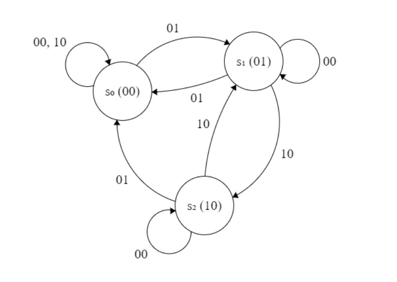
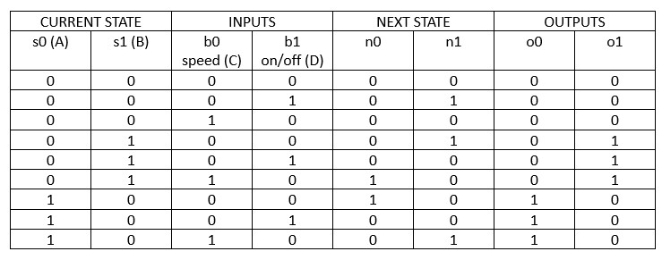
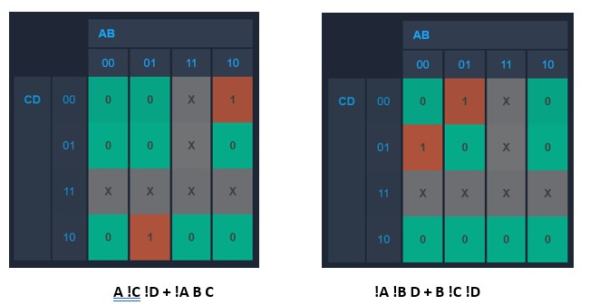
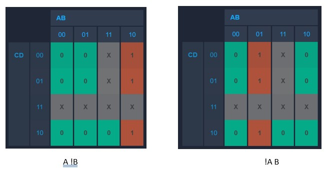
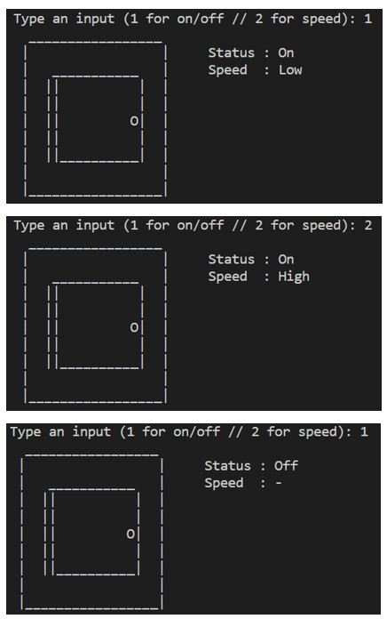

<h1> Introduction </h1>
The washing machine has three states, i.e., the on/off button and the speed button. When you enter 1, the washing machine will turn on at a low speed after initially being off. The speed can be changed by entering 2, going from low to high. The washing machine can also be turned off by entering 1.

<h1> FSM </h1>
The following is an FSM diagram that represents the washing machine use case.

<h1> Transition Table </h1>
From the FSM above, below is the transition table.

<h1> Karnaugh Map and the Combinatorial Equations </h1>
Based on the transition table, we can obtain the following Kmap.

<h1> How to Run </h1>
In VSC's terminal, type in: make

<h1> Output </h1>
Below is the output from my washing machine FSM:
