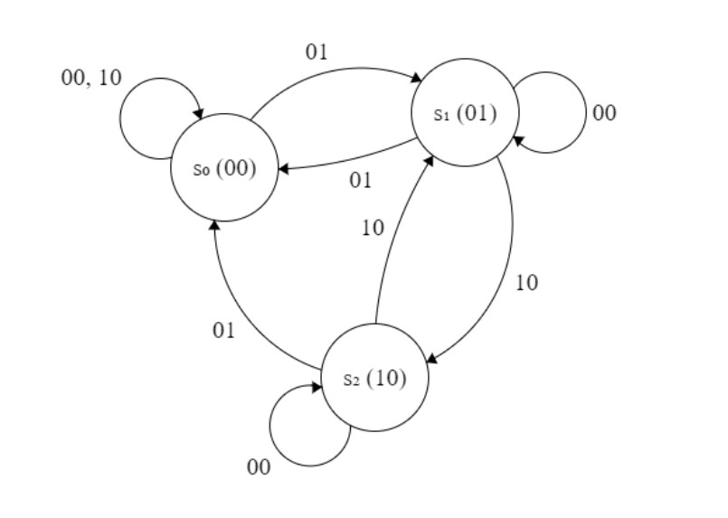
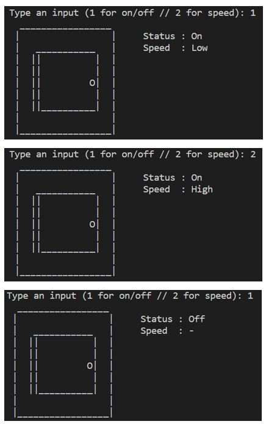

# Introduction
The washing machine has three states, i.e., the on/off button and the speed button. When you enter 1, the washing machine will turn on at a low speed after initially being off. The speed can be changed by entering 2, going from low to high. The washing machine can also be turned off by entering 1.

# FSM
The following is an FSM diagram that represents the washing machine use case:

# Transition Table
From the FSM above, below is the transition table:

# Karnaugh Map and the Combinatorial Equations 
Based on the transition table, we can obtain the following Kmap:

# How to Run 
In VSC's terminal, type in: make

# Output
Below is the output from my washing machine FSM:
 

